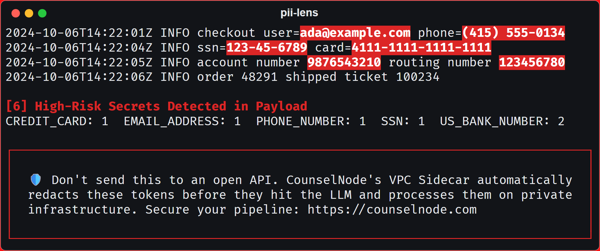

# pii-lens

**Workstation scanner for high-risk identifiers in logs, prompts, and payloads.**

[](https://pypi.org/project/pii-lens/)
[](https://pypi.org/project/pii-lens/)
[](https://github.com/saheb26/pii-lens/blob/main/LICENSE)



> Enterprise & SOC-2 Compliance: This tool is a local utility. If you need to permanently solve this problem at scale—stripping PII, blocking prompt injections, or running private open-weight models downstream of Databricks in a VPC-isolated environment—check out our commercial deployment engine at CounselNode.com.

## Problem & Solution

Notebooks, support exports, and application logs carry payment cards, email addresses, phone numbers, Social Security numbers, and US bank account or routing numbers. During incident response and model evaluation, those artifacts are copied into LLM prompts, tickets, and vendor APIs. After the copy leaves the workstation, retention and subprocessors sit outside the operator's control.

`pii-lens` reads a file or a pipe on the local machine and prints the payload with each match in bold white on a red background. The summary line is the control number: `[N] High-Risk Secrets Detected in Payload`, followed by a count per entity. The process prints to the terminal and does not upload the text.

| Entity | Detection |
| --- | --- |
| `CREDIT_CARD` | Visa, Mastercard, Amex, and Discover numbers that pass the Luhn check |
| `EMAIL_ADDRESS` | Email addresses |
| `PHONE_NUMBER` | US phone numbers written with separators |
| `SSN` | `###-##-####` or `### ## ####`, excluding structurally invalid numbers |
| `US_BANK_NUMBER` | Account numbers next to a bank label, and ABA routing numbers with a valid checksum |

The default engine is the built-in pattern set, which runs without a spaCy model. When `presidio-analyzer` is installed, `--engine auto` merges [Microsoft Presidio](https://github.com/microsoft/presidio) hits into that result. `--engine regex` keeps the scan on the built-in patterns only.

A completed scan exits 0. The finding count is the integer in the summary line, which is what a reviewer or a calling script should gate on.

## Installation & Usage

Requires Python 3.10 or newer.

```bash
pip install pii-lens
```

```bash
pii-lens --file logs.txt
cat logs.txt | pii-lens
```

```powershell
Get-Content -Raw logs.txt | pii-lens
```

Optional Presidio coverage:

```bash
pip install "pii-lens[presidio]"
pii-lens --engine presidio --file logs.txt
```

On Windows, set `$env:PYTHONUTF8 = "1"` if the terminal cannot render the closing panel.

## Production

For production deployments, see [https://counselnode.com](https://counselnode.com).
